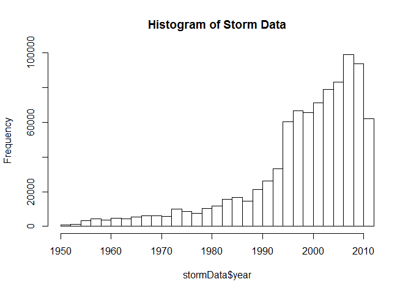
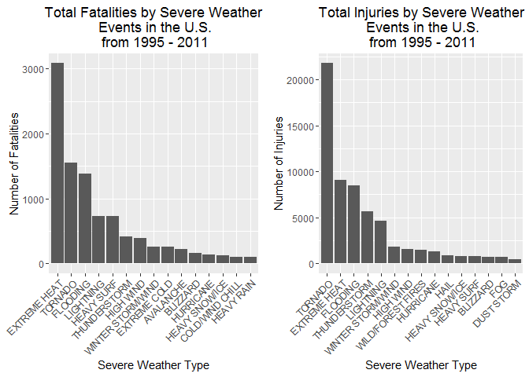
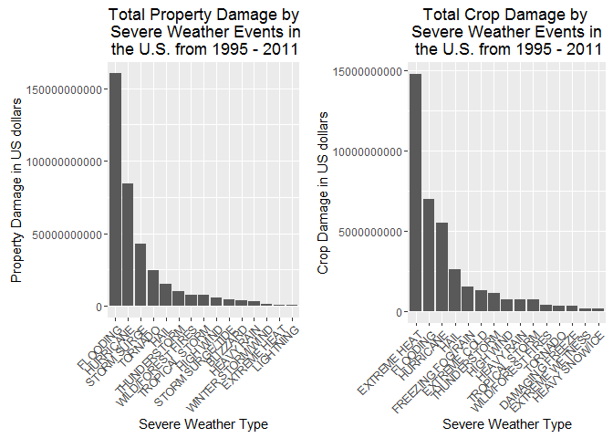

Reproducible Research: Peer Assessment 2
==========================================

## Impact of Severe Weather Events on Public Health and Economy in the United States

### Synonpsis  
In this report, we aim to analyze the impact of different weather events on public health and economy based on the storm database collected from the U.S. National Oceanic and Atmospheric Administration's (NOAA) from 1950 - 2011. We will use the estimates of fatalities, injuries, property and crop damage to decide which types of event are most harmful to the population health and economy. From these data, we found that excessive heat and tornado are most harmful with respect to population health, while flood, drought, and hurricane/typhoon have the greatest economic consequences.

### Basic settings

```r
echo = TRUE  # Always make code visible
options(scipen = 1)  # Turn off scientific notations for numbers

library(ggplot2)
library(plyr)

suppressWarnings(suppressMessages(library(R.utils)))
suppressWarnings(suppressMessages(require(gridExtra)))
```

### Data Processing
First, we download the data file and unzip it.

```r
if (!"StormData.csv.bz2" %in% dir("~/RData/")) {
    print("hhhh")
    download.file("http://d396qusza40orc.cloudfront.net/repdata%2Fdata%2FStormData.csv.bz2", destfile = "RData/stormData.csv.bz2")
    bunzip2("RData/stormData.csv.bz2", overwrite=T, remove=F)
}
```
Then, we read the generated csv file. If the data already exists in the working environment, we do not need to load it again. Otherwise, we read the csv file.

```r
if (!"stormData" %in% ls()) {
    stormData <- read.csv("RData/stormData.csv", sep = ",")
}
dim(stormData)
```

```
## [1] 902297     37
```

```r
head(stormData, n = 2)
```

```
##   STATE__          BGN_DATE BGN_TIME TIME_ZONE COUNTY COUNTYNAME STATE
## 1       1 4/18/1950 0:00:00     0130       CST     97     MOBILE    AL
## 2       1 4/18/1950 0:00:00     0145       CST      3    BALDWIN    AL
##    EVTYPE BGN_RANGE BGN_AZI BGN_LOCATI END_DATE END_TIME COUNTY_END
## 1 TORNADO         0                                               0
## 2 TORNADO         0                                               0
##   COUNTYENDN END_RANGE END_AZI END_LOCATI LENGTH WIDTH F MAG FATALITIES
## 1         NA         0                        14   100 3   0          0
## 2         NA         0                         2   150 2   0          0
##   INJURIES PROPDMG PROPDMGEXP CROPDMG CROPDMGEXP WFO STATEOFFIC ZONENAMES
## 1       15    25.0          K       0                                    
## 2        0     2.5          K       0                                    
##   LATITUDE LONGITUDE LATITUDE_E LONGITUDE_ REMARKS REFNUM
## 1     3040      8812       3051       8806              1
## 2     3042      8755          0          0              2
```
There are 902297 rows and 37 columns in total.
The events in the database start in the year 1950 and end in November 2011. In the earlier years of the database there are generally fewer events recorded, most likely due to a lack of good records. More recent years should be considered more complete.


```r
if (dim(stormData)[2] == 37) {
    stormData$year <- as.numeric(format(as.Date(stormData$BGN_DATE, format = "%m/%d/%Y %H:%M:%S"), "%Y"))
}
hist(stormData$year, breaks = 30, main = "Histogram of Storm Data")
```

<!-- -->

Based on the above histogram, we see that the number of events tracked starts to significantly increase around 1995. So, we use the subset of the data from 1990 to 2011 to get most out of good records.

```r
storm <- stormData[stormData$year >= 1995, ]
dim(storm)
```

```
## [1] 681500     38
```
Now, there are 681500 rows and 38 columns in total.

#### Impact on Public Health
In this section, we check the number of **fatalities** and **injuries** that are caused by the severe weather events. We would like to get the first 15 most severe types of weather events.

```r
sortHelper <- function(fieldName, top = 15, dataset = stormData) {
    index <- which(colnames(dataset) == fieldName)
    field <- aggregate(dataset[, index], by = list(dataset$EVTYPE), FUN = "sum")
    names(field) <- c("EVTYPE", fieldName)
    field <- arrange(field, field[, 2], decreasing = T)
    field <- head(field, n = top)
    field <- within(field, EVTYPE <- factor(x = EVTYPE, levels = field$EVTYPE))
    return(field)
}
```

#### Impact on Economy
We will convert the **property damage** and **crop damage** data into comparable numerical forms according to the meaning of units described in the code book ([Storm Events](http://ire.org/nicar/database-library/databases/storm-events/)). Both `PROPDMGEXP` and `CROPDMGEXP` columns record a multiplier for each observation where we have Hundred (H), Thousand (K), Million (M) and Billion (B).


```r
convertHelper <- function(dataset = storm, fieldName, newFieldName) {
    totalLen <- dim(dataset)[2]
    index <- which(colnames(dataset) == fieldName)
    dataset[, index] <- as.character(dataset[, index])
    logic <- !is.na(toupper(dataset[, index]))
    dataset[logic & toupper(dataset[, index]) == "B", index] <- "9"
    dataset[logic & toupper(dataset[, index]) == "M", index] <- "6"
    dataset[logic & toupper(dataset[, index]) == "K", index] <- "3"
    dataset[logic & toupper(dataset[, index]) == "H", index] <- "2"
    dataset[logic & toupper(dataset[, index]) == "", index] <- "0"
    dataset[, index] <- as.numeric(dataset[, index])
    dataset[is.na(dataset[, index]), index] <- 0
    dataset <- cbind(dataset, dataset[, index - 1] * 10^dataset[, index])
    names(dataset)[totalLen + 1] <- newFieldName
    return(dataset)
}

storm <- convertHelper(storm, "PROPDMGEXP", "propertyDamage")
```

```
## Warning in convertHelper(storm, "PROPDMGEXP", "propertyDamage"): NAs
## introduced by coercion
```

```r
storm <- convertHelper(storm, "CROPDMGEXP", "cropDamage")
```

```
## Warning in convertHelper(storm, "CROPDMGEXP", "cropDamage"): NAs introduced
## by coercion
```

```r
names(storm)
```

```
##  [1] "STATE__"        "BGN_DATE"       "BGN_TIME"       "TIME_ZONE"     
##  [5] "COUNTY"         "COUNTYNAME"     "STATE"          "EVTYPE"        
##  [9] "BGN_RANGE"      "BGN_AZI"        "BGN_LOCATI"     "END_DATE"      
## [13] "END_TIME"       "COUNTY_END"     "COUNTYENDN"     "END_RANGE"     
## [17] "END_AZI"        "END_LOCATI"     "LENGTH"         "WIDTH"         
## [21] "F"              "MAG"            "FATALITIES"     "INJURIES"      
## [25] "PROPDMG"        "PROPDMGEXP"     "CROPDMG"        "CROPDMGEXP"    
## [29] "WFO"            "STATEOFFIC"     "ZONENAMES"      "LATITUDE"      
## [33] "LONGITUDE"      "LATITUDE_E"     "LONGITUDE_"     "REMARKS"       
## [37] "REFNUM"         "year"           "propertyDamage" "cropDamage"
```

```r
options(scipen=999)
```

Now I'm going to clean up some of the obvious event_types errors.


```r
storm$EVTYPE <- toupper(storm$EVTYPE)
# remove leading and traling spaces
storm$EVTYPE <- gsub("^[[:space:]]+|[[:space:]]+$", "", storm$EVTYPE)
# make more uniform the used vocabulary
storm$EVTYPE <- gsub("EXCESSIVE|EXCESSIVELY|EXTREMELY", "EXTREME", storm$EVTYPE)
storm$EVTYPE <- gsub("FLOODINGINGS*|FLOOODING|FLOOD", "FLOODING", storm$EVTYPE)
storm$EVTYPE <- gsub("FLASH FLOODING.*", "FLOODING", storm$EVTYPE)
storm$EVTYPE <- gsub("LIGHTNING\\.|LIGHTING|LIGNTNING", "LIGHTNING", storm$EVTYPE)
storm$EVTYPE <- gsub("NON-", "NON ", storm$EVTYPE)
storm$EVTYPE <- gsub("PROLONG", "PROLONGED", storm$EVTYPE)
storm$EVTYPE <- gsub("RAINS", "RAIN", storm$EVTYPE)
storm$EVTYPE <- gsub("RIP CURRENTS", "RIP CURRENT", storm$EVTYPE)
storm$EVTYPE <- gsub("STORMS", "STORM", storm$EVTYPE)
storm$EVTYPE <- gsub("TORNDAO|TORNADOES", "TORNADO", storm$EVTYPE)
storm$EVTYPE <- gsub("TH*UND*ER*[A-Z]*RMW*|THUNDERSTROM|THUDERSTORM",
                    "THUNDERSTORM", storm$EVTYPE)
storm$EVTYPE <- gsub("TSTM WIND","THUNDERSTORM WIND", storm$EVTYPE)
storm$EVTYPE <- gsub("UNUSUALLY", "UNUSUAL", storm$EVTYPE)
storm$EVTYPE <- gsub("WILD.*FIRE.*|WILD/FOREST.*", "WILD/FOREST FIRES", storm$EVTYPE)
storm$EVTYPE <- gsub("WINDS|WND", "WIND", storm$EVTYPE)
storm$EVTYPE <- gsub("WINTERY", "WINTER", storm$EVTYPE)
storm$EVTYPE <- gsub("WARMTH", "WARM", storm$EVTYPE)
# grouping some events
storm$EVTYPE <- gsub("^BLIZZARD.*|ICE STORM", "BLIZZARD", storm$EVTYPE)
storm$EVTYPE <- gsub("^COASTAL.*|.*/CSTL .*", "COASTAL EROSION/FLOODING/STORM ",
                    storm$EVTYPE)
storm$EVTYPE <- gsub("EXTREME COLD.*|EXTENDED COLD.*", "EXTREME COLD", storm$EVTYPE)
storm$EVTYPE <- gsub("^DRY.*", "DRY CONDITIONS", storm$EVTYPE)
storm$EVTYPE <- gsub("^FLOODING.*", "FLOODING", storm$EVTYPE)
storm$EVTYPE <- gsub("^FREEZE|^FREEZING.*|^FROST.*",
                    "FREEZING FOG/RAIN/SLEET/SNOW", storm$EVTYPE)
storm$EVTYPE <- gsub("HAIL.*", "HAIL", storm$EVTYPE)
storm$EVTYPE <- gsub("DROUGHT|EXTREME HEAT.*|^HEAT.*", "EXTREME HEAT", storm$EVTYPE)
storm$EVTYPE <- gsub("HEAVY RAIN.*", "HEAVY RAIN", storm$EVTYPE)
storm$EVTYPE <- gsub("HURRICANE.*", "HURRICANE", storm$EVTYPE)
storm$EVTYPE <- gsub("HEAVY SNOW.*|^SNOW.*|EXCESSIVE SNOW", "HEAVY SNOW/ICE",
                    storm$EVTYPE)
storm$EVTYPE <- gsub("LIGHTNING.*", "LIGHTNING", storm$EVTYPE)
storm$EVTYPE <- gsub("^MARINE.*", "MARINE THUNDERSTORM/ACCIDENT", storm$EVTYPE)
storm$EVTYPE <- gsub("RAIN.*|PROLONGEDED RAIN", "RAIN", storm$EVTYPE)
storm$EVTYPE <- gsub("RIP CURRENT.*|HEAVY SURF.*|HIGH SURF.*", "HEAVY SURF", storm$EVTYPE)
storm$EVTYPE <- gsub("SLEET.*", "SLEET", storm$EVTYPE)
storm$EVTYPE <- gsub("VOLCANIC.*", "VOLCANIC", storm$EVTYPE)
storm$EVTYPE <- gsub("THUNDERSTORM.*|SEVERE THUNDERSTORM", "THUNDERSTORM", storm$EVTYPE)
storm$EVTYPE <- gsub("TORNADO.*", "TORNADO", storm$EVTYPE)
storm$EVTYPE <- gsub("TROPICAL STORM.*", "TROPICAL STORM", storm$EVTYPE)
storm$EVTYPE <- gsub("UNSEASONAL.*|^UNSEASONABL[EY].*|^^UNUSUAL.*",
                    "UNUSUAL WEATHER CONDITION", storm$EVTYPE)
storm$EVTYPE <- gsub("HIGH WIND.*|STRONG WIND.*|^WIND.*", "HIGH WIND", storm$EVTYPE)
storm$EVTYPE <- gsub("^WATERSPOUT.*|WATER SPOUT", "WATERSPOUT", storm$EVTYPE)
storm$EVTYPE <- gsub("^WINTER.*", "WINTER STORM/WIND", storm$EVTYPE)
storm$EVTYPE <- gsub("^NONE|^SUMMARY.*", "?", storm$EVTYPE)

# remove multiple spaces
storm$EVTYPE <- gsub("[[:space:]]+", " ", storm$EVTYPE)
```


### Results
As for the impact on public health, we have got two sorted lists of severe weather events below by the number of people badly affected.

```r
fatalities <- sortHelper("FATALITIES", dataset = storm)
injuries <- sortHelper("INJURIES", dataset = storm)

fatalities
```

```
##               EVTYPE FATALITIES
## 1       EXTREME HEAT       3083
## 2            TORNADO       1545
## 3           FLOODING       1376
## 4          LIGHTNING        730
## 5         HEAVY SURF        723
## 6       THUNDERSTORM        420
## 7          HIGH WIND        384
## 8  WINTER STORM/WIND        257
## 9       EXTREME COLD        254
## 10         AVALANCHE        223
## 11          BLIZZARD        155
## 12         HURRICANE        135
## 13    HEAVY SNOW/ICE        128
## 14   COLD/WIND CHILL         95
## 15        HEAVY RAIN         95
```

```r
injuries
```

```
##               EVTYPE INJURIES
## 1            TORNADO    21783
## 2       EXTREME HEAT     9107
## 3           FLOODING     8509
## 4       THUNDERSTORM     5652
## 5          LIGHTNING     4633
## 6  WINTER STORM/WIND     1851
## 7          HIGH WIND     1583
## 8  WILD/FOREST FIRES     1456
## 9          HURRICANE     1327
## 10              HAIL      916
## 11    HEAVY SNOW/ICE      807
## 12        HEAVY SURF      767
## 13          BLIZZARD      742
## 14               FOG      718
## 15        DUST STORM      420
```
And the following is a pair of graphs of total fatalities and total injuries affected by these severe weather events. 

```r
fatalitiesPlot <- qplot(EVTYPE, data = fatalities, weight = FATALITIES, geom = "bar") + 
    scale_y_continuous("Number of Fatalities") + 
    theme(axis.text.x = element_text(angle = 45, 
    hjust = 1)) + xlab("Severe Weather Type") + 
    ggtitle("Total Fatalities by Severe Weather\n Events in the U.S.\n from 1995 - 2011")
injuriesPlot <- qplot(EVTYPE, data = injuries, weight = INJURIES, geom = "bar") + 
    scale_y_continuous("Number of Injuries") + 
    theme(axis.text.x = element_text(angle = 45, 
    hjust = 1)) + xlab("Severe Weather Type") + 
    ggtitle("Total Injuries by Severe Weather\n Events in the U.S.\n from 1995 - 2011")
grid.arrange(fatalitiesPlot, injuriesPlot, ncol = 2)
```

<!-- -->

Based on the above histograms, we find that **Extreme Heat** and **Tornado** cause most fatalities and injuries in the United States from 1995 to 2011.

As for the impact on economy, we have got two sorted lists below by the amount of money cost by damages.  


```r
property <- sortHelper("propertyDamage", dataset = storm)
crop <- sortHelper("cropDamage", dataset = storm)

property
```

```
##               EVTYPE propertyDamage
## 1           FLOODING   160253654687
## 2          HURRICANE    84650180010
## 3        STORM SURGE    43193536000
## 4            TORNADO    24940710745
## 5               HAIL    15290424103
## 6       THUNDERSTORM    10064912851
## 7  WILD/FOREST FIRES     7760996500
## 8     TROPICAL STORM     7658335550
## 9          HIGH WIND     5535391013
## 10  STORM SURGE/TIDE     4641188000
## 11          BLIZZARD     4170064760
## 12        HEAVY RAIN     3156913440
## 13 WINTER STORM/WIND     1625345250
## 14      EXTREME HEAT     1066426750
## 15         LIGHTNING      793758159
```

```r
crop
```

```
##               EVTYPE  cropDamage
## 1       EXTREME HEAT 14821429500
## 2           FLOODING  6985099400
## 3          HURRICANE  5514792800
## 4               HAIL  2614217070
## 5  FREEZING FOG/RAIN  1505911000
## 6       EXTREME COLD  1312523000
## 7       THUNDERSTORM  1111513500
## 8          HIGH WIND   733499800
## 9         HEAVY RAIN   729899800
## 10    TROPICAL STORM   693886000
## 11 WILD/FOREST FIRES   402267630
## 12           TORNADO   296602970
## 13   DAMAGING FREEZE   296230000
## 14   EXTREME WETNESS   142000000
## 15    HEAVY SNOW/ICE   129183100
```
And the following is a pair of graphs of total property damage and total crop damage affected by these severe weather events. 

```r
propertyPlot <- qplot(EVTYPE, data = property, weight = propertyDamage, geom = "bar") + 
    theme(axis.text.x = element_text(angle = 45, hjust = 1)) + scale_y_continuous("Property Damage in US dollars")+ 
    xlab("Severe Weather Type") + ggtitle("Total Property Damage by\n Severe Weather Events in\n the U.S. from 1995 - 2011")

cropPlot<- qplot(EVTYPE, data = crop, weight = cropDamage, geom = "bar") + 
    theme(axis.text.x = element_text(angle = 45, hjust = 1)) + scale_y_continuous("Crop Damage in US dollars") + 
    xlab("Severe Weather Type") + ggtitle("Total Crop Damage by \nSevere Weather Events in\n the U.S. from 1995 - 2011")
grid.arrange(propertyPlot, cropPlot, ncol = 2)
```

<!-- -->

Based on the above histograms, we find that **Flooding** and **Hurricane** cause most property damage; **Extreme Heat** and **Flooding** causes most crop damage in the United States from 1995 to 2011.

### Conclusion  
From this data we can see that **Hurricane** and **Extreme Heat** causes the most damage to all sources with **Flooding** coming in second place. 
